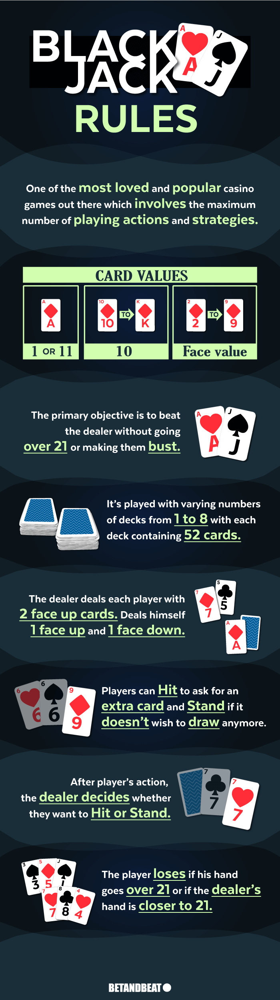

# Blackjack
Play blackjack in the terminal.

### Rules:

# Tasking
- Dealer under 17 = draws again
- refactor:
  - setup blackjack function
  - setup compare function
  - SetUp Win - Loose
  - setup play_game function
  - while input() == 'y': clear() play_game()
- Add fluff (welcome print, card display, Win/ Loss message)
